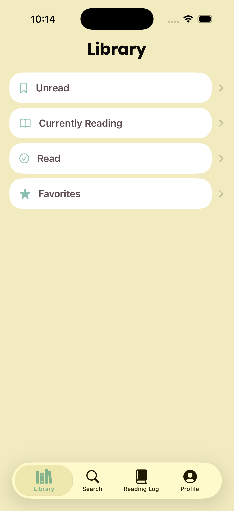
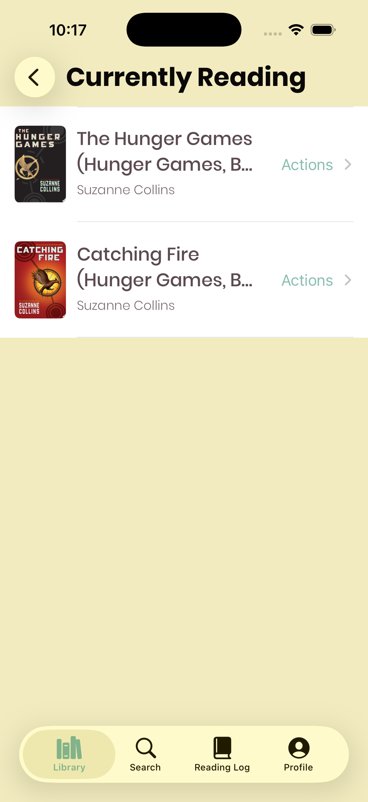
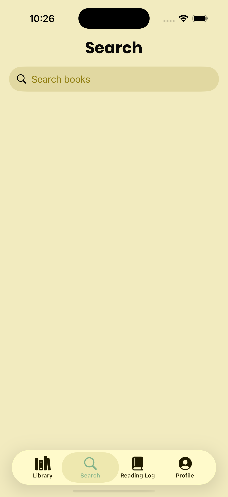
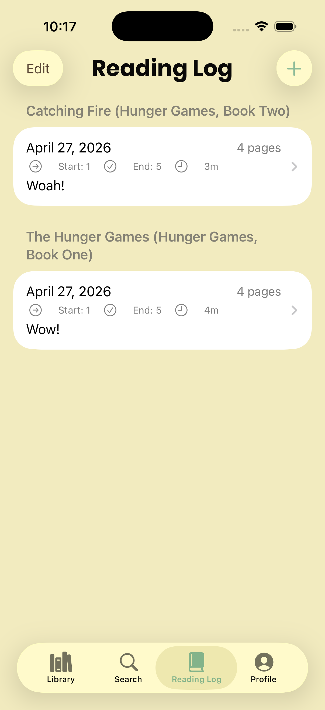
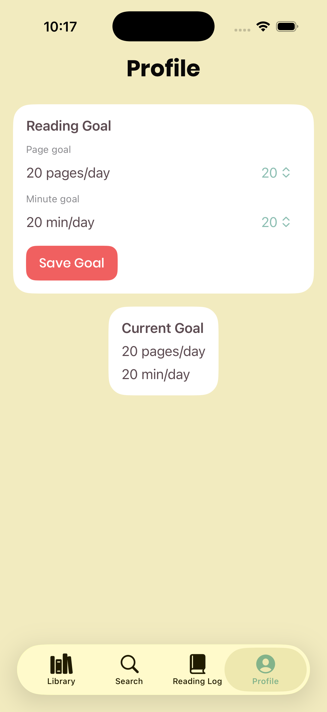

# Native App Development — Final Project
This is Bookworm. This is an app for all readers, but particuarly, those who care to have notes for their reading sessions. This app functions as a reading tracker where a user can search a book, add it to a shelf, and log a reading session. 

This app needs an API key for the Google Books API to run and from their the user can add the books they wanted to read, are currently reading, or have read to a shelf. 

From there or the reading log tab they can start a reading session where they can include the pages and time they read along with a reflection. These sessions are all stored on the reading log page. 

On the profile page, a user can set goals for themselves based on the time or pages they wanted to read.

